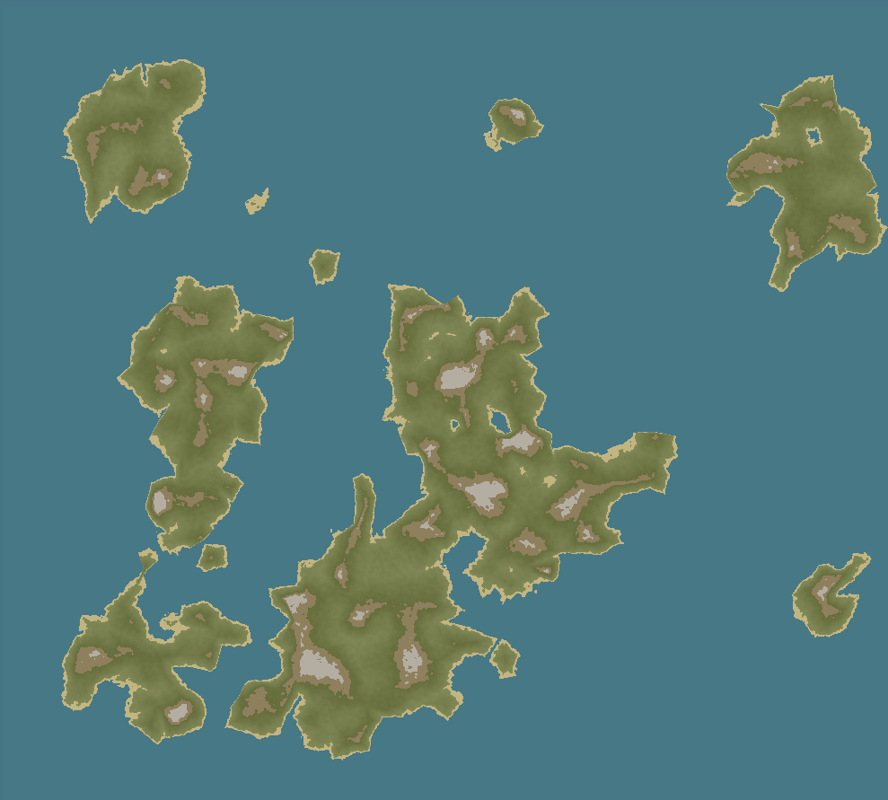

  
  <h1>Hodos</h1>

## An artistic procedural world map generator

Hodos is a simple client-side procedural world map generator running on JavaScript and WebGL. It combines both voronoïd cells and noise based algorithms to generate pseudo-random unique maps.

  

A public instance is available at [hodos.soremo.me](https://hodos.soremo.me/).

_Hodos, voyagez avec audace !_

Hodos creates maps for your imagination to thrive.

## Development

Requires Node.js 22.12 or later.

    npm install
    npm run dev            # dev server with live reload
    npm test               # unit tests (Vitest)
    npm run test:browser   # browser tests (Playwright, first run: npx playwright install chromium)
    npm run lint           # ESLint
    npm run format         # Prettier
    npm run build          # production build in dist/

The source is in `src/`: `generation/` builds the map data, `map/` renders it with WebGL, `ui/` wires the page controls.

## Deployment

Pushing to `master` runs the tests and deploys `dist/` to GitHub Pages
(repository Settings → Pages → Source: "GitHub Actions").

## Contributors

- [Smyler](https://github.com/SmylerMC/)
- [Artamis](https://github.com/JulienRibiollet)
- [Astate](https://github.com/Astate-I)
- [Soremo](https://github.com/Soremojinsen)

This repository is a fork of the original project. If you're interested in contributing, we encourage you to make a pull request on [the original repository](https://github.com/SmylerMC/Hodos).
